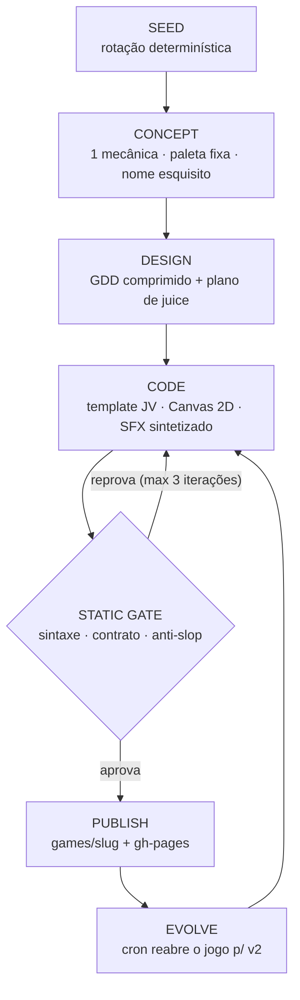

# Jogos Vivos

> Um graph workflow open-source que **cria, verifica, publica e evolui** web games —
> em loop contínuo, rodando de graça no GitHub Actions, e recusando qualquer jogo
> que pareça AI slop.



**A premissa:** agentes de código acertam 41–54% em engines reais (GameCraft-Bench,
GameDevBench). Um prompt que "escreve um jogo" não chega nem perto de publicável.
O que muda o jogo é: **template com contrato + gates determinísticos + loop de
reparo** — IA no código, humano no soul.

## O que este workflow faz de diferente

1. **Gate anti-slop como CI.** Em-dash, "not just X but Y", gradiente CSS, emoji como
   sprite, roxo default, paleta declarada mas não usada: tudo erro de build. O jogo
   genérico não sobe.
2. **Contrato JV, não prompt solto.** O LLM só escreve o miolo do jogo contra uma
   engine mínima (`JV.config`, `JV.game.update/draw/onKey/onPointer`, `JV.shake`,
   `JV.burst`, `JV.sfx`). Menu, game over, resize, mobile e recorde são do template.
3. **Zero tokens antes da hora.** O gate roda antes do juiz: sintaxe (`node --check`),
   contrato, paleta e copy — se o jogo nem abre, nenhum centavo de LLM é gasto.
4. **Git como banco de dados.** Cada jogo é `games/<slug>/index.html` + `report.json`.
   O histórico de evolução é o próprio git log. `state.json` garante rotação de seeds
   sem repetição.
5. **Honestidade radical.** Cada jogo carrega `report.json` com a seed, as iterações
   e os erros do gate. O processo é a história.

## Rodar

```bash
# demo offline (sem chave de API) — gera um jogo de exemplo em games/
python -m fabrica.cli run --mock

# de verdade (DeepSeek por padrão; copie .env.example → .env)
python -m fabrica.cli run

# ver o grafo
python -m fabrica.cli graph

# modo "voce e o LLM": concept/design/code prontos passam pelo mesmo gate
python -m fabrica.cli inject --spec spec.json --design design.json --code game.js --seed-idx 1
```

```bash
uv venv --python 3.12 && source .venv/bin/activate
uv pip install -e ".[dev]"
pytest -q
```

Abra `games/<slug>/index.html` no navegador. O jogo tem recorde persistido,
funciona em touch, carrega em <1s (single-file) e gasta ~US$0,05 por partida
gerada com DeepSeek off-peak.

## Stack

| Camada | Escolha | Por quê |
|---|---|---|
| Grafo | LangGraph | durable execution, conditional edges p/ loop de reparo |
| LLM | DeepSeek V4-Flash (+ fallback barato) | ~$0,05/jogo; Batch -50% |
| Jogo | Template Canvas 2D single-file | menor superfície de API = menos alucinação |
| SFX | síntese Web Audio (preset no código) | zero samples, zero licença |
| Gate | `node --check` + regras regex + checagem de contrato | determinístico e grátis |
| Infra | GitHub Actions (cron) + GitHub Pages | $0 em repo público |

## Anti-slop (as regras do gate)

As regras vivem em `fabrica/anti_slop.py` e `prompts/*.md` — fonte única usada
pelos prompts e pelo gate:

- uma mecânica por jogo; 30s de diversão no primeiro minuto;
- paleta nomeada de 3–5 cores escolhida ANTES do código;
- proibidos: em-dash, "not just X but Y", delve/testament/pivotal, gradientes, emoji-sprite, roxo default;
- juice obrigatório (screenshake, partículas, som em todo input relevante);
- consistência estética entre menu, jogo e game over (o shell do template garante);
- copy do jogo em pt-BR, com voz — nunca inglês genérico.

## Roadmap

- [x] **F1** — grafo local: SEED → CONCEPT → DESIGN → CODE → STATIC GATE (+ loop de reparo)
- [ ] **F2** — PLAYTEST (Playwright headless: fps, deadlock, smoke de estados) + JUDGE multimodal
- [ ] **F3** — PUBLISH automático: gh-pages + índice + devlog gerado
- [ ] **F4** — EVOLVE: cron reabre jogos publicados para v2 (balanceamento, juice, níveis)
- [ ] **F5** — skill library cross-game: mecânicas testadas reutilizadas entre jogos

## Licença

MIT. Os jogos gerados pelas suas chaves são seus; o template e o workflow são
livres para fork.
